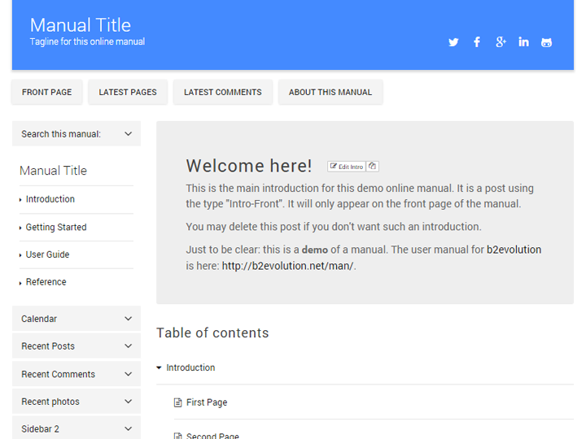

# Material Manual Skin

This is a skin for b2evolution CMS v6.

Link to skin: http://skins.b2evolution.net/material-manual-skin

====

### Update Log

#### v1.2.0-beta
- added .gitignore
- disps layout fix
- disp "flagged" enabled
- search form layout fix
- meta comments enabled

#### v1.1.1-stable
- added get_supported_coll_kinds() for getting supported collection kinds
- setting #skin_wrapper instead of <body> for custom_css
- Implemented meta-comments engine
- Fixed bug with comment forms
- Item Single widgets enabled for additional back-office customization on disp=single
- Modified back-office customization strings
- Fixed pagination style issue
- Additional small skin fixes
